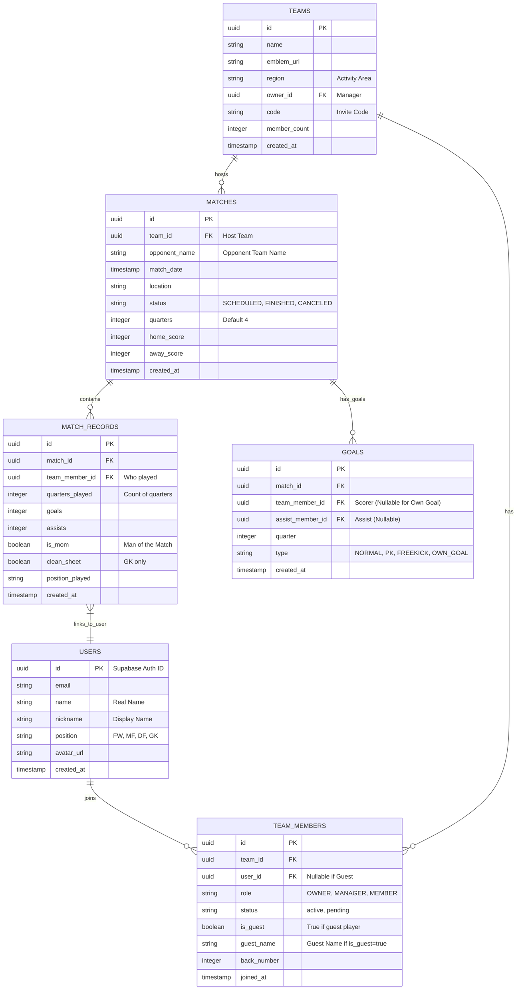

# Database Schema (ERD)

> [!NOTE]
> **Key Design Decisions**
> 1. **Mixed Membership**: `TEAM_MEMBERS` can represent both real users (`user_id` is set) and guests (`user_id` is null, `is_guest` is true).
> 2. **Own Goal Handling**: `GOALS` table has `type='OWN_GOAL'`. In this case, `team_member_id` determines WHO made the mistake (optional) OR it can be null. But importantly, logic must count this towards the OPPONENT's score but NOT the player's personal goal count.
> 3. **Denormalization**: `MATCHES` stores `home_score`, `away_score` for fast read, but it must strictly match `count(GOALS)` via Application Logic or Database Trigger.
